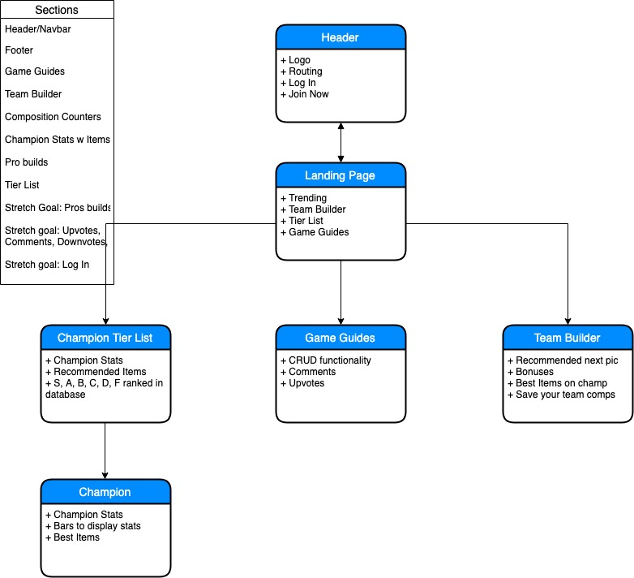

# _TFT Builds_
A site to create builds, give champion tier lists, and create posts for the strategy game, teamfight tactics.

#### By Darrion Gering

## Description

A site to connect users interested in the game, Teamfight Tactics by allowing them to post game builds, and discussions.

## Setup/Installation Requirements

* Clone the project from https://github.com/darrionkg/tftbuilds.git
* Import the database in the root directory.
* Host using dotnet
* Run in browser

## Known Bugs

## Specs

## Technologies Used
* HTML
* CSS
* C#
* .NET
* Jquery
* React
* EF core
* MySQL

### License
This software is licensed under the MIT license

Copyright (c) 2019 **_Darrion Gering_**
